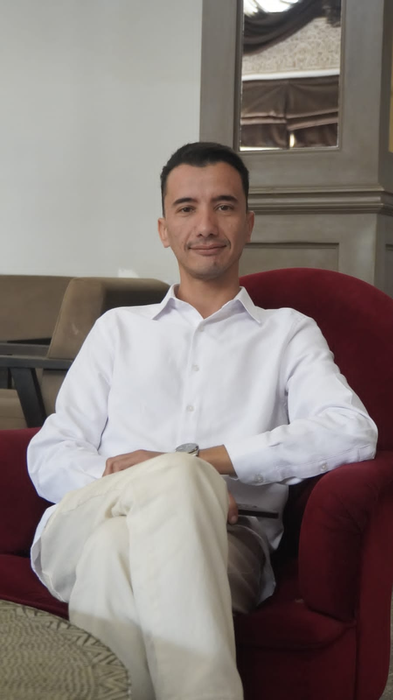

<div align="center">

<!-- ============================== -->
<!--        HEADER / BANNER        -->
<!-- ============================== -->


<br/>

<!-- Circular avatar -->


<br/><br/>

<h2 style="color:#00f2fe;">👋 Hi, I'm Yassine — @yassinemeta</h2>

<p><i>Empowering businesses through scalable software, automated workflows, and high-converting Web/AI solutions.</i></p>

<br/>


<br/><br/>

<!-- Social Media & Contact Badges -->
<a href="https://yassinmeta.com">
  
</a>
<a href="https://www.linkedin.com/in/yassine-sellak-691b2627a">
  
</a>
<a href="https://instagram.com/yasmark">
  
</a>
<a href="https://x.com/yasmrke">
  
</a>
<a href="https://wa.me/212691438703">
  
</a>

<br/>

<a href="mailto:contact@yassinmeta.com">
  
</a>
<a href="mailto:hello@yassinmeta.com">
  
</a>

</div>

<br/>


<!-- ============================== -->
<!--           ABOUT ME            -->
<!-- ============================== -->

### About Me

```yaml
name: "Mohamed Yassine Sellak"
role: "Full-Stack Developer | AI & Business Systems Automation Specialist"
company: "YassinMeta"
location: "Morocco 🇲🇦"
contact:
  email: ["contact@yassinmeta.com", "hello@yassinmeta.com"]
  phone: "+212 6 91 43 87 03"
focus:
  - Building AI-driven automation pipelines
  - Shipping high-converting Web/AI solutions
  - Automating business workflows with n8n & GPT-4o
