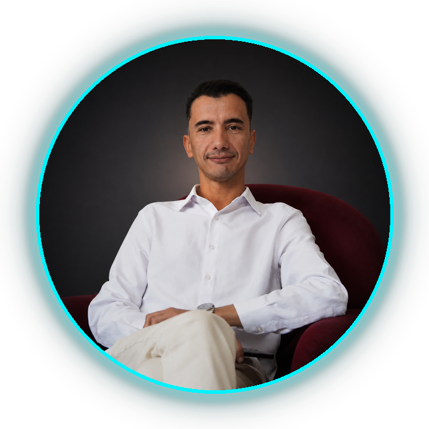

<div align="center">

<!-- BANNER -->


<br/><br/>

<!-- PROFILE AVATAR -->
<a href="https://yassinmeta.com">
  
</a>

<br/><br/>

<h2>👋 I'm Yassine — <code>@yassinemeta</code></h2>

<p>
  <i>Empowering businesses through scalable software, automated workflows,<br/>
  and high-converting Web/AI solutions.</i>
</p>

<br/>


<br/><br/>

<!-- CTA BUTTONS -->
<a href="https://yassinmeta.com">
  
</a>
<a href="https://wa.me/212691438703">
  
</a>

<br/><br/>

<a href="https://www.linkedin.com/in/yassine-sellak-691b2627a"></a>
<a href="https://instagram.com/yasmark"></a>
<a href="https://x.com/yasmrke"></a>
<a href="mailto:contact@yassinmeta.com"></a>
<a href="mailto:hello@yassinmeta.com"></a>

</div>

<br/>


<br/>

<!-- ABOUT ME -->
### 🧠 About Me

```yaml
name: "Mohamed Yassine Sellak"
role: "Full-Stack Developer | AI & Business Systems Automation Specialist"
company: "YassinMeta"
location: "Morocco 🇲🇦"
contact:
  email: ["contact@yassinmeta.com", "hello@yassinmeta.com"]
  phone: "+212 6 91 43 87 03"
focus:
  - Designing AI-driven automation pipelines that eliminate manual busywork
  - Shipping fast, high-converting Web & SaaS products
  - Building GEO/AIO strategies — optimizing brands for the AI-first web
currently:
  - Growing YassinMeta as a full-service AI automation & web agency
  - Architecting n8n + GPT-4o powered workflow systems for clients
  - Shipping AI-enhanced Android productivity apps (micro-SaaS track)
